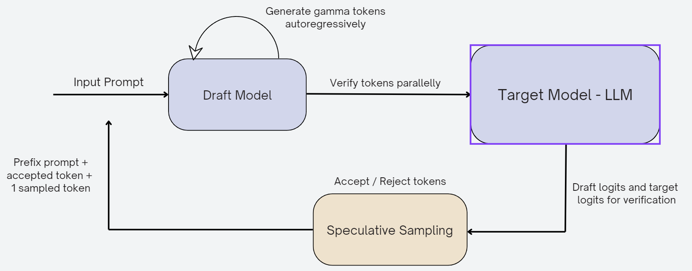

# ANLP-Project-Speculative-Decoding
Contributors - Sanika Damle, Sarthak Chittawar, Shashwat Dash

## Files used
* `translation_spec_dec.ipynb` -> for implementing basic Speculative Decoding
* `base_spec_experiments.ipynb` -> for ablations on speculative decoding
* `llama_spec.ipynb` -> for speculative decoding on a generation task
* `online_spec_dec.ipynb` -> for implementing Online Speculative Decoding (OSD)

### Done as a part of the course project for the course - Advanced NLP (Monsoon 2024) at IIIT Hyderabad
